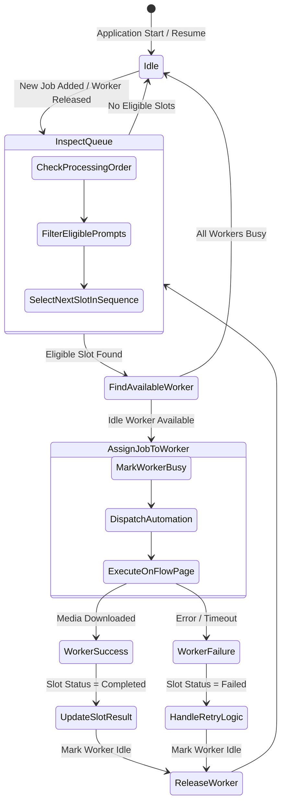

# Technical Architecture & Implementation Specification: Google Flow Desktop Application (Windows)

**Document Version:** 1.0.0  
**Target Platform:** Windows 10 / 11 (x64)  
**Status:** Architecture Specification — Pending Implementation Approval  
**Foundation Base:** `TMSSS05/google-flow-browser-mcp`  

---

## 1. Product Architecture

### 1.1 Overview & Product Vision
The Google Flow Desktop Application is an enterprise-grade Windows desktop software designed for digital creators, advertising teams, and content studios. It enables users to batch-generate images and videos using Google Flow (`https://labs.google/fx/tools/flow`) across multiple independent Google accounts simultaneously.

The software abstracts the complexity of browser automation behind an intuitive, modern desktop interface packaged as a native Windows executable (`.exe`). Users never run terminal commands, shell scripts, or manual browser flags.

```
+---------------------------------------------------------------------------------------+
|                               WINDOWS DESKTOP APPLICATION                             |
|                                                                                       |
|  +---------------------------------------------------------------------------------+  |
|  |                           RENDERER PROCESS (DESKTOP UI)                         |  |
|  |  - Project Dashboard     - Prompt Matrix (Image/Video)   - Profile Manager      |  |
|  |  - Order-Preserved Cards - Live Generation Workspace     - Settings & History   |  |
|  +------------------------------------------^--------------------------------------+  |
|                                             | IPC (Typed Events & Commands)           |
|  +------------------------------------------v--------------------------------------+  |
|  |                            MAIN PROCESS (ELECTRON CORE)                         |  |
|  |  +---------------------+  +----------------------+  +------------------------+  |  |
|  |  |   Project Manager   |  |  Job Queue Scheduler |  | Profile Session Pool   |  |  |
|  |  | (CRUD, Persistence) |  | (FIFO, Worker Alloc) |  | (Port & Path Registry) |  |  |
|  |  +---------------------+  +----------------------+  +------------------------+  |  |
|  |  +---------------------+  +----------------------+  +------------------------+  |  |
|  |  |    Asset Manager    |  |  Process Supervisor  |  | Automation Engine      |  |  |
|  |  | (Thumbnails, Files) |  |  (Chrome Auto-Detect)|  | (Refactored Flow Logic)|  |  |
|  |  +---------------------+  +----------------------+  +------------------------+  |  |
|  +------------------------------------------+--------------------------------------+  |
+---------------------------------------------|-----------------------------------------+
                                              | CDP (Chrome DevTools Protocol)
           +----------------------------------+----------------------------------+
           |                                  |                                  |
+----------v-----------+           +----------v-----------+           +----------v-----------+
| Chrome Worker 01     |           | Chrome Worker 02     |           | Chrome Worker 03     |
| Port: 9222           |           | Port: 9223           |           | Port: 9224           |
| Profile: profile-001 |           | Profile: profile-002 |           | Profile: profile-003 |
| Account: userA@gmail |           | Account: userB@gmail |           | Account: userC@gmail |
+----------------------+           +----------------------+           +----------------------+
```

### 1.2 Core Capabilities
1. **Single-Click Windows Launch:** Distributed as a standalone setup installer (`.exe`) and portable executable.
2. **Deterministic Prompt Sequencing:** Fixed-position prompt grid. If Prompt 1 completes after Prompt 3, Prompt 1's result renders strictly in Slot 1. No jumping or reordering.
3. **Guaranteed Nano Banana 2 Enforcement:** Dedicated UI automation that actively verifies and switches the Google Flow model dropdown to Nano Banana 2.
4. **Complete Video Lifecycle Automation:** Extends video generation from setup-only to full prompt dispatch, generation trigger, rendering detection, and automatic `.mp4` download.
5. **Multi-Account Concurrent Workers:** Independent Google profiles running on dedicated CDP ports and isolated Windows directories without mutual interference.
6. **Persistence & Crash Recovery:** Interrupted projects resume exactly where they stopped upon restarting the application.

---

## 2. Technology Choice: Electron vs. Tauri

### 2.1 Side-by-Side Evaluation

| Evaluation Criteria | Electron (Node.js + Chromium) | Tauri (Rust + Webview2) | Impact on Google Flow Automation |
|---|---|---|---|
| **Playwright Integration** | **Native (Tier 1):** Direct in-process Node.js execution. Zero serialization friction. | **Complex / Fragile:** Requires bundling a Node.js sidecar binary or using unproven Rust CDP libraries. | High risk in Tauri due to sidecar synchronization and packaging overhead. |
| **Browser & Process Control** | **Comprehensive:** Native `child_process`, Win32 API access, `tree-kill`, and stream control. | **Strict / Sandboxed:** Requires Rust FFI and custom IPC command wrappers for process trees. | Chrome process management and port probing are trivial in Node.js. |
| **MCP Compatibility** | **100% Direct:** Reuses `@modelcontextprotocol/sdk` directly in TypeScript/Node.js. | **Indirect:** Must bridge MCP JSON-RPC through Rust stdio sidecar. | Electron saves weeks of architectural translation. |
| **Windows Deployment** | **Battle-Tested:** `electron-builder` handles code signing, NSIS installer, auto-updates. | **Lightweight:** Tiny binary, but depends on end-user Windows Webview2 runtime stability. | Webview2 is fine, but Playwright still requires Node.js runtime. |
| **Memory Footprint** | Higher (~120MB baseline for desktop UI). | Very Low (~35MB baseline for desktop UI). | Negligible difference when 2-3 Chrome instances (~500MB each) are running. |
| **Development Velocity** | **High:** Single language (TypeScript) across UI, backend, Playwright, and automation. | **Medium-Low:** Dual language barrier (Rust backend + TypeScript frontend). | Eliminates context switching and boilerplate. |

### 2.2 Final Architectural Decision: Electron (Node.js + React + TypeScript)
**Electron is chosen** as the primary application framework.  
*Rationale:* Because Google Flow automation fundamentally requires Node.js (Playwright, Chrome CDP client, MCP SDK), using Tauri would necessitate bundling a secondary Node.js runtime alongside the Rust executable. Electron provides the exact unified runtime needed to execute Playwright, manage Windows processes, and render the desktop GUI without complex inter-runtime IPC bridges.

---

## 3. Desktop Application Architecture

### 3.1 Multi-Process Model
```
[ Windows OS ]
  │
  └── [ Electron Main Process (Node.js Core) ]
        ├── Window Manager (Main Window, Login Modal)
        ├── IPC Controller (Bidirectional typed IPC)
        ├── Service Layer:
        │     ├── ProfileManager
        │     ├── BrowserSessionManager
        │     ├── FlowJobScheduler
        │     ├── FlowAutomationEngine
        │     ├── ProjectManager
        │     └── AssetManager
        └── Storage Layer:
              ├── SQLite / NeDB Project Database
              └── Windows File System Manager
        │
        └── [ Electron Renderer Process (Chromium GUI) ]
              ├── React 18 + TypeScript + Tailwind CSS
              ├── Zustand State Store (Projects, Profiles, Jobs, Active Grid)
              └── Realtime IPC Event Listeners (WebSocket-like responsiveness)
```

### 3.2 Security & Sandboxing Policies
1. **`contextIsolation: true`** enforced on all `BrowserWindow` instances.
2. **`nodeIntegration: false`** in Renderer to prevent prototype pollution and arbitrary code execution.
3. **Secure Preload Script (`preload.ts`):** Exposes a typed, strictly validated `window.electronAPI` bridge via `contextBridge.exposeInMainWorld`.
4. **No External Credentials:** Google accounts authenticate exclusively inside Google's official sign-in flow within the Chrome profile. The desktop app stores no passwords or OAuth tokens.

---

## 4. UI Architecture

### 4.1 Major Screen Hierarchy

```
[ Top Navigation Bar ] -> Projects | Profiles | Settings | System Status Badge
─────────────────────────────────────────────────────────────────────────────
  1. Projects Screen          -> Grid/List of existing projects with status & metrics
  2. New Project Wizard       -> Name, Campaign, Mode (Image/Video/Both), Ratio Selection
  3. Prompt Input Matrix      -> Multi-line input for Images & Videos with sequence index
  4. Generation Workspace     -> Realtime execution board with fixed-position prompt cards
  5. Profile Manager          -> Manage Google accounts, connection health, CDP ports
  6. Project History / Assets -> Filterable media gallery with direct Explorer shortcuts
  7. Settings Screen          -> Chrome executable paths, output base dir, timeout options
```

### 4.2 Detailed Screen Specifications

#### Screen 1: Projects Dashboard
- **Components:** New Project Button, Project Search Bar, Recent Projects Table/Grid.
- **Card Data:** Project Name, Campaign Tag, Creation Date, Progress Bar (e.g., `8/12 Prompts Completed`), Active Profiles Assigned, Action Buttons (Open, Duplicate, Archive, Delete).

#### Screen 2 & 3: New Project & Prompt Input Matrix
- **Input Type Selector:**
  - `[x] Images Only`
  - `[ ] Videos Only`
  - `[ ] Images & Videos`
- **Aspect Ratio Picker (Enforced at creation):**
  - Segmented toggle: `[ 16:9 Landscape ]` vs `[ 9:16 Portrait / Shorts / Reels ]`.
- **Processing Order (Visible when both Image and Video are selected):**
  - Radio options:
    1. `Images First (Recommended)` — Completes all image assets before starting videos.
    2. `Videos First` — Starts long video renders first.
    3. `Automatic / Balanced` — Dispatches tasks to any free worker regardless of type.
- **Prompt Input Fields:**
  - Dedicated numbered multi-line textareas.
  - Users can paste bulk prompts (split by newline) or add cards dynamically.
  - Live drag-and-drop ordering *before* generation begins. Once launched, order is locked.

#### Screen 4: Profile Manager
- Displays all configured Google Flow workers.
- Each profile card shows:
  - Profile Display Name (e.g., `"Marketing Main"`, `"Studio 02"`).
  - Assigned CDP Port (e.g., `9222`, `9223`).
  - Google Account Email (detected from UI chip or user note).
  - Status Indicator: `● Ready (Idle)`, `● Busy (Generating)`, `● Disconnected`, `▲ Auth Required`.
  - Actions: `Connect Browser`, `Open Visible Chrome (Login)`, `Disconnect`, `Delete`.

#### Screen 5: Generation Workspace (Fixed-Slot Deterministic Grid)
- A responsive grid of prompt cards.
- **Card Slot Principle:** Each card has a fixed index `0..N-1`.
  - Slot 1 always represents Prompt 1.
  - Slot 2 always represents Prompt 2.
  - Slot 3 always represents Prompt 3.
- **Card Layout:**
```
┌──────────────────────────────────────────────────────────────┐
│  SLOT #01                       [ Status: COMPLETED ]        │
├──────────────────────────────────────────────────────────────┤
│  PREVIEW AREA (Fixed 16:9 / 9:16 Aspect Ratio)               │
│                                                              │
│  [ High-Resolution Generated Image / Video Player Preview ]  │
│                                                              │
├──────────────────────────────────────────────────────────────┤
│  Prompt #01: A futuristic cyberpunk city in neon rain...     │
│  Type: IMAGE | Ratio: 16:9 | Model: Nano Banana 2            │
│  Worker: Profile 02 (Port 9223) | Duration: 14.2s            │
├──────────────────────────────────────────────────────────────┤
│  [ View Fullsize ]  [ Open in Explorer ]  [ Re-Generate ]    │
└──────────────────────────────────────────────────────────────┘
```
- **Loading State:** While generating, the preview area renders a sleek shimmer skeleton with animated status text:
  `Connecting -> Checking Project -> Verifying Nano Banana 2 -> Generating (12s) -> Downloading`.
- **Error State:** If failed, renders clear error description with a `[ Retry This Slot ]` button.

---

## 5. Backend Architecture

### 5.1 Service Layer Breakdown
```
src/main/
├── index.ts                     # Electron lifecycle & app ready handler
├── preload.ts                   # Context bridge & typed IPC exposure
├── ipc/                         # IPC command & event handlers
│   ├── project.ipc.ts           # Handlers for project CRUD
│   ├── profile.ipc.ts           # Handlers for profile operations
│   └── generation.ipc.ts       # Handlers for start/stop/retry jobs
├── services/
│   ├── ProfileManager.ts        # Manages profiles, directories & ports
│   ├── BrowserSessionManager.ts # Spawns Chrome, connects Playwright CDP
│   ├── FlowJobScheduler.ts      # Multi-worker FIFO task dispatcher
│   ├── ProjectManager.ts        # Project state machine & storage
│   ├── AssetManager.ts          # File downloads, thumbnailing, disk structure
│   └── WindowsProcessService.ts # Windows Chrome path detection & PID killer
└── engine/                      # Core Automation Primitives
    ├── FlowDriver.ts            # Page interaction primitives & anti-bot bypass
    ├── ProjectNavigator.ts      # Multi-language project entering & sidebar tabs
    ├── ImageAutomation.ts       # Dropdown selection & image generation
    └── VideoAutomation.ts       # Complete video trigger & polling lifecycle
```

---

## 6. MCP Integration Architecture

### 6.1 Adapting the Existing Codebase
The existing `google-flow-browser-mcp` is an MCP server written around stdio communication. In the desktop application, we decouple the automation primitives from the MCP stdio wrapper:

1. **Internal Direct Service Execution:** The desktop application communicates directly with `FlowAutomationEngine` via TypeScript method calls. This eliminates stdio JSON serialization bottlenecks, avoids `console.log` stdout pollution bugs, and allows rich binary and stream handling.
2. **Dual-Role Capability (Optional Sidecar MCP):** For users who *also* want their external AI agent (Claude Desktop, OpenCode, Cursor) to automate the desktop app, the application hosts a lightweight local MCP Gateway (over loopback HTTP/SSE or stdio) that delegates tool calls into the running `FlowJobScheduler`.

---

## 7. Multi-Profile Architecture

### 7.1 Complete Worker Isolation
To prevent Google session collisions and browser lockfile conflicts, each profile operates with absolute filesystem and network boundary isolation.

```
%LOCALAPPDATA%\GoogleFlowApp\
├── profiles\
│   ├── profile_17170001\       <-- Worker 1
│   │   ├── GoogleChromeData\   <-- Persistent Chrome User Data
│   │   └── profile.json        <-- Config: Port 9222, Name: "Account Alpha"
│   ├── profile_17170002\       <-- Worker 2
│   │   ├── GoogleChromeData\   <-- Persistent Chrome User Data
│   │   └── profile.json        <-- Config: Port 9223, Name: "Account Beta"
│   └── profile_17170003\       <-- Worker 3
│       ├── GoogleChromeData\   <-- Persistent Chrome User Data
│       └── profile.json        <-- Config: Port 9224, Name: "Account Gamma"
```

### 7.2 Profile Worker Lifecycle
1. **Provisioning:** User clicks `Add Profile`. App creates a new persistent folder and allocates the next free CDP port (starting from `9222`).
2. **Initial Authentication (Interactive):** App launches Chrome with `headless: false`. User signs into Google once. Chrome saves session cookies into that profile's `GoogleChromeData`.
3. **Operational Mode:** When running jobs, Chrome runs in standard or optimized mode. Session cookies remain intact permanently across app reboots.
4. **No Temporary Cloning:** The hazardous `/tmp/chrome-kiara-cdp-...` recursive copying found in the prototype is completely eliminated.

---

## 8. Browser & Session Architecture

### 8.1 Windows Chrome Installation Detection
The app automatically scans for the Google Chrome executable on Windows in the following order:
1. Windows Registry: `HKLM\SOFTWARE\Microsoft\Windows\CurrentVersion\App Paths\chrome.exe`
2. `%PROGRAMFILES%\Google\Chrome\Application\chrome.exe`
3. `%PROGRAMFILES(X86)%\Google\Chrome\Application\chrome.exe`
4. `%LOCALAPPDATA%\Google\Chrome\Application\chrome.exe`
5. Custom user-specified path configured in Settings.

### 8.2 Chrome Process Spawning & Flags
Chrome is spawned via Node.js `child_process.spawn()` with specific anti-detection arguments:
```typescript
const chromeArgs = [
  `--remote-debugging-port=${profile.cdpPort}`,
  `--user-data-dir=${profile.userDataPath}`,
  '--no-first-run',
  '--no-default-browser-check',
  '--disable-blink-features=AutomationControlled',
  '--password-store=basic',
  '--disable-features=IsolateOrigins,site-per-process',
  '--window-size=1920,1080',
];
if (profile.runHeadless) {
  chromeArgs.push('--headless=new');
}
```

### 8.3 Playwright CDP Connection
Once Chrome's debugging port responds to HTTP health checks (`http://127.0.0.1:${port}/json/version`), Playwright attaches:
```typescript
const browser = await chromium.connectOverCDP(`http://127.0.0.1:${profile.cdpPort}`);
const context = browser.contexts()[0] || await browser.newContext();
const page = context.pages()[0] || await context.newPage();
```

---

## 9. Job Scheduler Architecture

### 9.1 Multi-Profile FIFO Dispatcher
The scheduler bridges the ordered list of prompt slots with available profile workers.



### 9.2 Concurrency Guarantees
- **Profile Concurrency:** Exactly 1 active job per Google Flow profile worker at any time.
- **Application Concurrency:** Up to $K$ parallel jobs across $K$ registered, enabled profiles.
- **Deterministic Slot Binding:** Job completion updates `project.slots[promptIndex]` directly. It never pushes results into an unindexed array.

---

## 10. Project Data Model

### 10.1 Schema Definition (`project.json`)
```typescript
interface ProjectData {
  id: string;                         // UUIDv4 (e.g., "proj_8f1b2c3d")
  name: string;                       // "Summer Campaign 2026"
  campaignTag?: string;               // "summer-26"
  createdAt: string;                  // ISO 8601
  updatedAt: string;                  // ISO 8601
  status: 'draft' | 'queued' | 'running' | 'paused' | 'completed';
  settings: {
    imageRatio: '16:9' | '9:16';
    videoRatio: '16:9' | '9:16';
    processingOrder: 'images_first' | 'videos_first' | 'balanced';
    autoRetry: boolean;
    maxRetries: number;
  };
  slots: PromptSlot[];                // Preserves exact input order
  stats: {
    totalImages: number;
    totalVideos: number;
    completedImages: number;
    completedVideos: number;
    failedCount: number;
  };
}
```

---

## 11. Prompt / Job / Result Data Model

```typescript
interface PromptSlot {
  slotIndex: number;                  // 0, 1, 2... (Exact order preservation)
  promptId: string;                   // UUIDv4 (Permanent identity)
  type: 'image' | 'video';
  promptText: string;
  status: 'draft' | 'queued' | 'running' | 'completed' | 'failed';
  activeJobId?: string;
  assignedProfileId?: string;
  result?: {
    assetId: string;
    mediaPath: string;                // Absolute path to local .png / .mp4
    thumbnailPath?: string;           // Local thumbnail .jpg
    width: number;
    height: number;
    durationSeconds?: number;
    modelUsed: string;                // "Nano Banana 2", "Veo 3.1", etc.
    completedAt: string;
  };
  error?: {
    code: string;
    message: string;
    timestamp: string;
    retryCount: number;
  };
}

interface GenerationJob {
  jobId: string;
  projectId: string;
  promptId: string;
  slotIndex: number;
  type: 'image' | 'video';
  profileId: string;
  status: 'pending' | 'running' | 'completed' | 'failed';
  startedAt?: string;
  completedAt?: string;
}
```

---

## 12. Asset Storage Model

### 12.1 Organized File System Layout
All project assets are organized cleanly by project in Windows local app data:
```
%LOCALAPPDATA%\GoogleFlowApp\
├── projects\
│   ├── proj_8f1b2c3d\
│   │   ├── project.json              <-- Complete state & metadata
│   │   ├── images\
│   │   │   ├── slot_01_banana_8f1b.png
│   │   │   └── slot_02_banana_9a2c.png
│   │   ├── videos\
│   │   │   ├── slot_03_veo_7b3e.mp4
│   │   │   └── slot_04_veo_4c1f.mp4
│   │   ├── thumbnails\
│   │   │   ├── thumb_slot_01.jpg
│   │   │   └── thumb_slot_03.jpg
│   │   └── logs\
│   │       └── automation.log
```

---

## 13. State Machine Definitions

```
PROMPT SLOT STATE MACHINE:
[draft] ──(Enqueue)──> [queued] ──(Worker Assigned)──> [running]
                             ▲                            │
                             │                            ├─(Success)──> [completed]
                             └──(Retry)── [failed] <──────┘
```

```
PROFILE WORKER STATE MACHINE:
[unconfigured] ──> [disconnected] ──(Launch Chrome)──> [connecting]
                          ▲                                 │
                          │                                 ├─(OAuth Detected)─> [auth_required]
                          │                                 │
                          ├────────── [ready_idle] <────────┘
                          │               │
                          │          (Job Start)
                          │               ▼
                          └─────────── [busy] ──(Job Finish)──> [ready_idle]
```

---

## 14. Error & Retry Strategy

### 14.1 Error Classification & Handling Matrix

| Error Code | Root Cause | Automated Action | User Guidance |
|---|---|---|---|
| `AUTH_CHALLENGE_DETECTED` | Google login wall or CAPTCHA. | Pause worker immediately. Do not kill browser. | Bring Chrome window to front: *"Please complete Google verification to continue."* |
| `MODEL_UNAVAILABLE` | Nano Banana 2 not in dropdown. | Abort slot. Do not consume video credits. | *"Nano Banana 2 was not detected in this Flow workspace."* |
| `GENERATION_TIMEOUT` | Flow queue stalled (>180s). | Mark slot as failed. Release worker lock. | Automatically retry once if configured; else display manual Retry button. |
| `NETWORK_DISCONNECT` | CDP connection lost. | Attempt reconnection up to 3 times with backoff. | If failed, mark worker disconnected. |
| `RATE_LIMIT_REACHED` | Google account quota exceeded. | Disable profile worker for 30 minutes. | Reassign pending slots to other active profiles. |

---

## 15. IPC / API Contract

### 15.1 Strongly Typed IPC Methods (`ElectronMain <-> Renderer`)

```typescript
// Invoked from Renderer (ipcRenderer.invoke)
export interface IpcApi {
  // Projects
  'project:list': () => Promise<ProjectSummary[]>;
  'project:get': (projectId: string) => Promise<ProjectData>;
  'project:create': (params: CreateProjectInput) => Promise<ProjectData>;
  'project:delete': (projectId: string) => Promise<void>;
  'project:start': (projectId: string) => Promise<void>;
  'project:pause': (projectId: string) => Promise<void>;
  'project:retrySlot': (projectId: string, slotIndex: number) => Promise<void>;

  // Profiles
  'profile:list': () => Promise<ProfileSummary[]>;
  'profile:create': (name: string) => Promise<ProfileSummary>;
  'profile:delete': (profileId: string) => Promise<void>;
  'profile:launchVisible': (profileId: string) => Promise<void>;
  'profile:connect': (profileId: string) => Promise<void>;
  'profile:disconnect': (profileId: string) => Promise<void>;

  // System & Files
  'system:openPath': (absolutePath: string) => Promise<void>;
  'system:selectDirectory': () => Promise<string | null>;
}
```

---

## 16. Event System for Live UI Updates

### 16.1 Targeted Slot Broadcasts
Rather than streaming large monolithic project states across IPC, the backend broadcasts surgical events that update the specific card in the React state:

```typescript
// Pushed from Main to Renderer (mainWindow.webContents.send)
export type IpcPushEvents = {
  'slot:statusChanged': {
    projectId: string;
    slotIndex: number;
    status: 'queued' | 'running' | 'completed' | 'failed';
    profileId?: string;
  };
  'slot:progress': {
    projectId: string;
    slotIndex: number;
    step: string;               // e.g. "Generating (45s elapsed)..."
    percent?: number;
  };
  'slot:completed': {
    projectId: string;
    slotIndex: number;
    result: PromptSlot['result'];
  };
  'slot:failed': {
    projectId: string;
    slotIndex: number;
    error: PromptSlot['error'];
  };
  'profile:stateChanged': {
    profileId: string;
    status: ProfileStatus;
    activeJobId?: string;
  };
};
```

---

## 17. Windows Path & Storage Strategy

### 17.1 Standardized Directory Hierarchy
```
%LOCALAPPDATA%\GoogleFlowApp\
├── config\
│   └── app_settings.json
├── database\
│   └── app.db (SQLite / NeDB)
├── profiles\
│   └── profile_{id}\GoogleChromeData\
├── projects\
│   └── {projectId}\...
└── logs\
    └── app.log
```

---

## 18. Process Lifecycle & Windows Supervisor

### 18.1 Clean Process Trees
On Windows, child Chrome processes can become orphaned if a parent Node.js process terminates abruptly.
- **Process Supervisor:** Stores the PID of every spawned Chrome process in an active registry.
- **Process Termination:** Uses the Windows-native command `taskkill /pid {PID} /T /F` (or `tree-kill`) to ensure Chrome GPU processes, crashpad handlers, and network utilities terminate cleanly.
- **Port Checking Before Launch:** Before spawning Chrome on port `9222`, the app probes the port with a socket connection. If already bound by an orphaned Chrome, it gracefully closes it before starting fresh.

---

## 19. Crash Recovery Strategy

### 19.1 Cold Startup Self-Healing
When the desktop application launches:
1. **Orphan Cleanup:** Scans for Chrome processes running against `%LOCALAPPDATA%\GoogleFlowApp\profiles` and gracefully shuts them down.
2. **Database Reconciliation:** Scans `projects/`. Any prompt slot with status `running` is transitioned to `interrupted`.
3. **Recovery Prompt:** When opening an interrupted project, the user is presented with:
   `[ Continue Generation (Resume 4 unfinished slots) ]`.

---

## 20. EXE Packaging Strategy

### 20.1 `electron-builder` Configuration
- **Installer Type:** NSIS 1-Click Installer + Portable Single-File `.exe`.
- **Target Architecture:** `x64` (Windows 10 / 11).
- **Embedded Binaries:** Node.js runtime and Playwright Chromium driver dependencies packaged directly inside the app ASAR archive.
- **Icons & Metadata:** High-resolution `.ico` assets, Company/Product Windows metadata, and elevated execution privileges only if required for installation.

---

## 21. Existing MCP Changes Required

### 21.1 Core Modifications to Existing Code
1. **Decouple from Stdio Transport:** Remove dependency on `StdioServerTransport` for internal desktop execution.
2. **De-singletonize:** Refactor `src/browser/connect.js`, `src/queue/job-queue.js`, and `src/utils/config.js` from module-level global variables into class instances parameterized by `profileId`.
3. **Eliminate Linux Assumptions:** Replace `/opt/google/chrome/chrome`, `process.env.HOME`, and `.config/google-chrome` with dynamic Windows path resolvers.
4. **Fix Model Selection Logic:** Implement actual UI click interaction to set the model to `Nano Banana 2` rather than merely validating the existing label.
5. **Implement Real Video Lifecycle:** Add Generate button trigger, polling loop, and `.mp4` download handling.

---

## 22. Files & Modules That Should Be Rewritten

1. **[`src/browser/connect.js`](file:///d:/google-flow-browser-mcp-main/src/browser/connect.js) & [`src/browser/launch-profile.js`](file:///d:/google-flow-browser-mcp-main/src/browser/launch-profile.js):** Complete rewrite into `BrowserSessionManager.ts` (Windows-native, multi-port, multi-directory).
2. **[`src/queue/job-queue.js`](file:///d:/google-flow-browser-mcp-main/src/queue/job-queue.js):** Complete rewrite into `FlowJobScheduler.ts` (FIFO, multi-worker, persistent state).
3. **[`src/tools/generate-image.js`](file:///d:/google-flow-browser-mcp-main/src/tools/generate-image.js):** Complete rewrite into `ImageAutomation.ts` (real dropdown selection, background media download without `page.goto` disruption).
4. **[`src/tools/generate-video.js`](file:///d:/google-flow-browser-mcp-main/src/tools/generate-video.js):** Complete rewrite into `VideoAutomation.ts` (end-to-end video lifecycle).
5. **[`src/tools/download-latest.js`](file:///d:/google-flow-browser-mcp-main/src/tools/download-latest.js):** Rewrite to use Playwright's native `page.waitForEvent('download')`.

---

## 23. Files & Modules That Can Be Reused

1. **TRPC Redirect Regex (`generate-image.js:255`):** Regex pattern `/media\.getMediaUrlRedirect\?name=([a-f0-9-]+)/` for identifying generated media UUIDs.
2. **DOM Introspection Helper (`safe-actions.js:113-181`):** `detectPageElements()` logic for UI inspection and debugging.
3. **Anti-Detection Spawning Arguments (`connect.js:56-63`):** Chromium CLI flags to bypass Google OAuth automation detection.
4. **Flow Project URL Concept (`project-navigator.js`):** Knowledge of `/project/{uuid}` navigation structure.

---

## 24. Testing Strategy

1. **Unit Tests (Vitest):**
   - Prompt slot indexing & order preservation algorithms.
   - Scheduler queue assignment logic with varying profile counts.
   - Project and profile JSON schema validation.
2. **Mock CDP Tests:**
   - Chrome process launcher and port allocator.
   - IPC handler request/response verification.
3. **Live E2E Windows Verification:**
   - Spawning visible Chrome on Windows 10/11.
   - Navigating to Google Flow, switching model to Nano Banana 2, generating 1 image slot, and validating saved `.png` on disk.
   - Validating parallel generation across 2 concurrent profiles.

---

## 25. Development Phases

- **Phase 1: Architecture, Core Foundation & Windows Driver** (Multi-profile Chrome launcher, CDP attach, Windows Chrome detector).
- **Phase 2: Automation Engine Refactoring** (Reliable Nano Banana 2 image generation, non-destructive download, video lifecycle).
- **Phase 3: Persistence, Queue Scheduler & Project Core** (Fixed-slot prompt matrix, FIFO multi-worker scheduler, SQLite/JSON persistence).
- **Phase 4: Electron Desktop Shell & IPC Bridge** (Electron main/preload, typed IPC handlers, process supervisor).
- **Phase 5: React UI Implementation** (7 screens, fixed-slot prompt cards, live updates, video player, profile manager).
- **Phase 6: Windows Packaging & E2E Hardening** (NSIS installer, crash recovery, stress testing).

---

## 26. Risks and Mitigations

1. **Risk: Google Flow UI Updates Break Locators.**  
   *Mitigation:* Implement multi-strategy locators (`data-testid` -> `aria-label` -> SVG icons -> multilingual regex text). Include visual debug screenshots on failures.
2. **Risk: High Memory Usage with Multiple Profiles.**  
   *Mitigation:* Allow users to configure maximum concurrent workers (e.g., default 2-3). Idle profiles can sleep their browser context.
3. **Risk: Google Account Captchas / Bot Challenges.**  
   *Mitigation:* Never try to bypass captchas programmatically. Automatically raise the Chrome window to `fullscreen: true`, notify the user, and wait for human resolution.

---

## 27. Recommended Folder Structure for the New Application

```
google-flow-desktop/
├── package.json
├── electron-builder.yml
├── tsconfig.json
├── vite.config.ts
├── src/
│   ├── main/                        # Electron Main Process (Node.js)
│   │   ├── index.ts
│   │   ├── preload.ts
│   │   ├── ipc/                     # Typed IPC Controllers
│   │   ├── services/                # Application Business Logic
│   │   │   ├── ProfileManager.ts
│   │   │   ├── BrowserSessionManager.ts
│   │   │   ├── FlowJobScheduler.ts
│   │   │   ├── ProjectManager.ts
│   │   │   └── AssetManager.ts
│   │   └── engine/                  # Flow Automation Core (Refactored MCP)
│   │       ├── FlowDriver.ts
│   │       ├── ProjectNavigator.ts
│   │       ├── ImageAutomation.ts
│   │       └── VideoAutomation.ts
│   │
│   └── renderer/                    # Electron Renderer Process (React GUI)
│       ├── index.html
│       ├── src/
│       │   ├── App.tsx
│       │   ├── components/          # Reusable UI (Cards, Modals, Buttons)
│       │   │   ├── PromptSlotCard.tsx
│       │   │   ├── ProfileStatusBadge.tsx
│       │   │   └── VideoPreviewModal.tsx
│       │   ├── screens/             # The 7 Major Screens
│       │   │   ├── ProjectsScreen.tsx
│       │   │   ├── NewProjectScreen.tsx
│       │   │   ├── PromptInputScreen.tsx
│       │   │   ├── WorkspaceScreen.tsx
│       │   │   ├── ProfilesScreen.tsx
│       │   │   ├── HistoryScreen.tsx
│       │   │   └── SettingsScreen.tsx
│       │   └── store/               # Zustand Global State Stores
│       │       ├── projectStore.ts
│       │       └── profileStore.ts
```

---

## READY FOR IMPLEMENTATION

**Recommended First Phase to Implement:**  
`Phase 1: Windows Chrome Detection & Multi-Profile CDP Session Manager`  
*(Building the non-destructive Windows Chrome launcher that discovers the installed Chrome executable, manages isolated profile directories under `%LOCALAPPDATA%`, assigns dynamic CDP ports, and connects Playwright without modifying existing repository code).*
