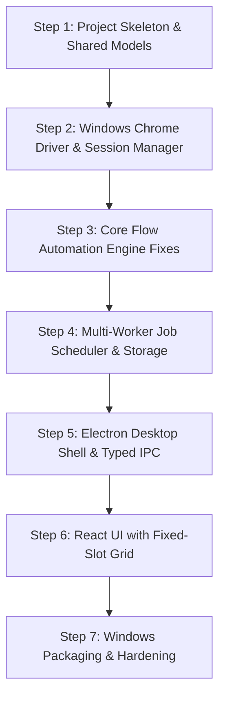

# Migration Plan: Evolving `google-flow-browser-mcp` into the Windows Desktop Application

**Document Version:** 1.0.0  
**Target Platform:** Windows 10 / 11 (x64)  
**Status:** Migration Plan — Pending Implementation Approval  
**Source Codebase:** `TMSSS05/google-flow-browser-mcp` (Local directory: `d:\google-flow-browser-mcp-main`)  

---

## 1. Executive Summary & Migration Philosophy

The existing `google-flow-browser-mcp` repository contains valuable exploratory automation logic for Google Flow, particularly the anti-detection Chrome launch arguments and the TRPC image redirect detection pattern. However, because it was built as a single-profile Linux prototype communicating via stdio, it cannot be used "as-is" for a production Windows desktop application.

### Core Migration Principles:
1. **Zero Destructive Changes:** The existing repository files remain intact and functional during initial phases. All new architecture is developed in modular, testable components alongside the existing code.
2. **Decoupling from stdio Transport:** The automation engine will be extracted into clean TypeScript/JavaScript service classes callable directly via Node.js in-process calls.
3. **From Linux Singletons to Windows Multi-Tenant:** Eliminate global state variables (`browser`, `page`, `jobQueue`) and Linux-only file paths (`/opt/google/chrome/chrome`, `~/.config/google-chrome`), replacing them with parameterized session instances under `%LOCALAPPDATA%`.
4. **Closing Functional Holes:** Fix model selection (actively switching to Nano Banana 2 in the UI) and complete the video generation lifecycle before assembling the graphical user interface.

---

## 2. Inventory of Existing Assets & Categorization

| Existing File / Module | Classification | Migration Action |
|---|---|---|
| [`src/browser/connect.js`](file:///d:/google-flow-browser-mcp-main/src/browser/connect.js) | **Rewrite** | Extract anti-detection flags; replace temporary profile cloning and global singletons with an instance-based `BrowserSessionManager`. |
| [`src/browser/launch-profile.js`](file:///d:/google-flow-browser-mcp-main/src/browser/launch-profile.js) | **Rewrite** | Remove hardcoded `Profile 3` and Linux paths; parameterize profile directories and support Windows Chrome paths. |
| [`src/browser/account-check.js`](file:///d:/google-flow-browser-mcp-main/src/browser/account-check.js) | **Refactor** | Convert to an async method on `ProfileSession`; add multi-language account detection. |
| [`src/browser/safe-actions.js`](file:///d:/google-flow-browser-mcp-main/src/browser/safe-actions.js) | **Reuse with Extensions** | `detectPageElements()` and `safeClick()` are reused directly; update `safeFill()` to handle contenteditable divs cleanly. |
| [`src/navigation/project-navigator.js`](file:///d:/google-flow-browser-mcp-main/src/navigation/project-navigator.js) | **Refactor** | Fix project stickiness bug (where it reuses the wrong project URL); replace French-only locators (`Modifier`, `Supprimer`, `Nouveau projet`) with multilingual selectors. |
| [`src/queue/job-queue.js`](file:///d:/google-flow-browser-mcp-main/src/queue/job-queue.js) | **Replace** | Replace the single-slot in-memory lock with `FlowJobScheduler`, an asynchronous multi-worker FIFO queue supporting persistence and slot indexing. |
| [`src/tools/generate-image.js`](file:///d:/google-flow-browser-mcp-main/src/tools/generate-image.js) | **Refactor & Fix** | Keep TRPC regex `/media\.getMediaUrlRedirect\?name=([a-f0-9-]+)/`. Add UI automation to actively select Nano Banana 2 and aspect ratios. Replace destructive `page.goto()` downloads with non-navigating background fetch. |
| [`src/tools/generate-video.js`](file:///d:/google-flow-browser-mcp-main/src/tools/generate-video.js) | **Complete & Rewrite** | Build complete video generation lifecycle: trigger Generate button, poll for rendering, detect completed video elements, and download `.mp4`. |
| [`src/tools/download-latest.js`](file:///d:/google-flow-browser-mcp-main/src/tools/download-latest.js) | **Replace** | Replace with an `AssetManager` service that uses Playwright's native `page.waitForEvent('download')` and organizes files into project folders. |
| [`src/utils/config.js`](file:///d:/google-flow-browser-mcp-main/src/utils/config.js) | **Replace** | Replace static synchronous JSON loader with dynamic profile configuration management. |
| [`src/utils/logger.js`](file:///d:/google-flow-browser-mcp-main/src/utils/logger.js) | **Refactor** | Remove `console.log` (which corrupts stdio) and Node 20 `import.meta.dirname` calls; direct logs to file and UI event bus. |
| [`src/utils/errors.js`](file:///d:/google-flow-browser-mcp-main/src/utils/errors.js) | **Reuse** | Reuse `FlowError` and expand error codes (`AUTH_CHALLENGE_DETECTED`, `MODEL_UNAVAILABLE`, etc.). |
| [`src/utils/screenshots.js`](file:///d:/google-flow-browser-mcp-main/src/utils/screenshots.js) | **Reuse** | Reuse debug screenshot capture, directing output to `%LOCALAPPDATA%\GoogleFlowApp\logs\screenshots\`. |
| [`src/index.js`](file:///d:/google-flow-browser-mcp-main/src/index.js) | **Preserve as Sidecar** | Retain as an optional MCP server endpoint that interfaces with the new engine. |

---

## 3. Step-by-Step Evolution Roadmap

---

### Step 1: Project Skeleton & Shared Type Definitions
- **Goal:** Set up the new application structure without disturbing existing files.
- **Actions:**
  1. Initialize Electron + React + TypeScript structure (`src/main`, `src/renderer`, `src/shared`).
  2. Define shared TypeScript interfaces:
     - `ProjectData`, `PromptSlot`, `GenerationJob`
     - `ProfileConfig`, `ProfileStatus`
     - `IpcApi` (Renderer to Main) and `IpcPushEvents` (Main to Renderer).
  3. Verify TypeScript builds cleanly.

---

### Step 2: Windows Chrome Driver & Session Manager
- **Goal:** Create a 100% reliable, non-destructive Windows Chrome launcher and CDP connection manager.
- **Actions:**
  1. Implement `WindowsProcessService` / `WindowsChromeFinder`:
     - Scan Windows Registry and standard Program Files paths to locate `chrome.exe`.
     - Strictly enforce non-recursive process termination (`proc.kill('SIGTERM')` followed by non-recursive `taskkill /pid <pid> /F` without `/T` or `/IM`) targeting only the specific child process PID.
  2. Implement `BrowserSessionManager` / `ProfileSessionManager`:
     - Create dedicated persistent profile directories under `%LOCALAPPDATA%\AutomistLabs\FlowProfiles\<profile-id>\chrome-user-data`.
     - Allocate dynamic CDP ports (e.g., 9222, 9223, 9224...).
     - Launch Chrome with anti-detection arguments (`--disable-blink-features=AutomationControlled`).
     - Attach Playwright via `chromium.connectOverCDP()`.
  3. Validate interactive login & multi-profile concurrency:
     - Provide a helper to launch visible Chrome so the user can log into their Google account once inside the dedicated profile.
     - Validate that session cookies persist across restarts within that profile directory.
     - Ensure normal user Chrome profiles and sessions are completely isolated and never terminated or modified.

---

### Step 3: Core Flow Automation Engine Fixes
- **Goal:** Make image and video automation robust, multilingual, and accurate.
- **Actions:**
  1. **Fix Project Navigation (`ProjectNavigator`):**
     - Fix project URL stickiness bug: verify active URL matches requested project ID before reusing.
     - Replace French strings with resilient locators (`button:has-text("New project"), button:has-text("Nouveau projet"), [aria-label*="project"]`).
  2. **Fix Image Generation (`ImageAutomation`):**
     - **Active Model Selection:** Implement the UI interaction to open the model dropdown and explicitly select `Nano Banana 2`.
     - **Aspect Ratio Selection:** Click the ratio button (`16:9` or `9:16`) in the Flow UI.
     - **Non-Destructive Download:** Replace `page.goto(trpcUrl)` with background fetch or Playwright request context (`page.request.get(trpcUrl)`), keeping the browser page open on the project canvas.
  3. **Complete Video Generation (`VideoAutomation`):**
     - Implement prompt entry, ratio, duration, and quantity configuration.
     - Implement the generation trigger click (governed by user confirmation settings).
     - Implement video completion polling (watching for `<video>` DOM elements or video TRPC URLs).
     - Implement `.mp4` video downloading and thumbnail extraction.

---

### Step 4: Multi-Worker Job Scheduler & Storage Layer
- **Goal:** Build the engine that orchestrates multi-account generation while preserving prompt slots.
- **Actions:**
  1. Implement `ProjectManager`:
     - Create project folder `%LOCALAPPDATA%\GoogleFlowApp\projects\{projectId}\`.
     - Save and load `project.json`.
     - Maintain strict index ordering of prompt slots `0..N-1`.
  2. Implement `FlowJobScheduler`:
     - Multi-worker FIFO task dispatcher.
     - Assigns next eligible slot to an idle profile worker.
     - Enforces "Images First", "Videos First", or "Balanced" dispatching.
     - Updates the specific prompt slot directly upon completion or failure.
     - Serializes state to disk so jobs resume after application crashes.

---

### Step 5: Electron Desktop Shell & Typed IPC Bridge
- **Goal:** Connect the backend services to the desktop window via secure, typed IPC.
- **Actions:**
  1. Implement `preload.ts` using `contextBridge.exposeInMainWorld('electronAPI', ...)`.
  2. Implement IPC handlers in `src/main/ipc/` for projects, profiles, and generation control.
  3. Implement event emitters in `FlowJobScheduler` that push targeted slot updates (`slot:progress`, `slot:completed`, `slot:failed`) directly to the renderer.

---

### Step 6: React UI Implementation (The 7 Screens)
- **Goal:** Build the user-facing desktop application.
- **Actions:**
  1. Setup Tailwind CSS, Lucide icons, and component libraries.
  2. Build Screen 1: Projects Dashboard (search, list, open, create).
  3. Build Screen 2 & 3: New Project & Prompt Input Matrix (ratio selection, processing order toggle, bulk prompt entry).
  4. Build Screen 4: Profile Manager (add profile, launch visible login, connection indicators).
  5. Build Screen 5: Generation Workspace (fixed-slot grid, shimmer loading cards, live status badges, video playback, full prompt modal, retry button).
  6. Build Screen 6 & 7: History Gallery & Application Settings.

---

### Step 7: Windows Packaging & Production Hardening
- **Goal:** Package the application into a production-ready Windows installer.
- **Actions:**
  1. Configure `electron-builder.yml` for Windows x64 (NSIS installer + portable EXE).
  2. Test installation, desktop shortcuts, and uninstallation.
  3. Verify cold-start behavior, orphan process cleanup, and offline error handling.

---

## 4. Coexistence Strategy During Development

To ensure development never breaks existing features:
1. The existing MCP server scripts remain runnable in their current state.
2. New architecture is placed in a clean, structured directory structure (`src/main/`, `src/renderer/`, `src/shared/`).
3. Shared automation utilities are extracted cleanly into an `engine/` package that both the new desktop app and the MCP server can import.

---

## 5. Fallback & Rollback Plan

- Each migration phase has a clear, isolated test checkpoint.
- If a live Google Flow selector changes during development, the `engine/` locators can be updated without altering the UI, scheduler, or desktop shell.
- Diagnostic screenshots and network logs are captured automatically in `%LOCALAPPDATA%\GoogleFlowApp\logs\screenshots\` on any automation failure.

---

## READY FOR IMPLEMENTATION

**Recommended First Phase to Implement:**  
`Phase 1: Windows Chrome Detection & Multi-Profile CDP Session Manager`  
*(Building the non-destructive Windows Chrome launcher that discovers the installed Chrome executable, manages isolated profile directories under `%LOCALAPPDATA%`, assigns dynamic CDP ports, and connects Playwright without modifying existing repository code).*
