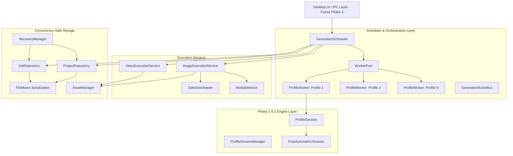

# Phase 3 Implementation Report — Persistent Generation Engine & Multi-Profile Scheduler

**Project**: Google Flow Windows Desktop Application  
**Repository**: [https://github.com/aiautomation786786/Automist-Labs-Flow](https://github.com/aiautomation786786/Automist-Labs-Flow)  
**Date**: September 2026  
**Status**: Completed & Verified  

---

## Executive Summary

Phase 3 delivers the persistent generation engine and multi-profile scheduler for the Google Flow Windows Desktop Application. It serves as the bridge between ordered project prompt collections and isolated Google Flow profile worker sessions.

All Phase 3 goals were achieved under strict concurrency and safety requirements:
- **Zero Paid Credit Consumption**: Automated test suites operate with deterministic mocked execution and dry runs.
- **Concurrency-Safe Persistence**: In-process serialized mutexes (`FileMutex`) coupled with atomic write-rename semantics prevent lost updates across concurrent workers updating `project.json` and `jobs.json`.
- **Strict One-Job-Per-Profile Constraint**: `ProfileWorker` strictly enforces single-job execution; attempts to assign a second task throw immediate errors.
- **Deterministic Prompt Slot Mapping**: Prompt slot ordering `0..N-1` is immutable. Out-of-order job completions (`[2, 0, 3, 1]`) map results directly back to their original slots without shifting index arrays.
- **Strict 13-State Machine**: Validates all lifecycle transitions and prevents illegal state corruptions.
- **Delta Media Detection & Safe Background Downloads**: Pre/post generation snapshot diffing matches exact newly produced assets without navigating the main Flow page away.
- **Startup Crash Recovery**: Interrupted in-flight jobs are recovered cleanly on startup based on verified output asset existence on disk.
- **100% Passing Tests**: 131 unit and integration tests passing across 19 test suites (43 new Phase 3 tests).

---

## 1. Phase 3 Architecture & Component Hierarchy



---

## 2. Component Implementation Details

### 2.1 Concurrency-Safe Persistence (`FileMutex.ts`, `ProjectRepository.ts`, `JobRepository.ts`)
- **Problem**: When Worker A and Worker B concurrently read `project.json` or `jobs.json`, modify it, and write back, traditional file renames alone suffer from lost updates (Worker B overwriting Worker A's update with stale data).
- **Solution**:
  - `FileMutex` provides a promise-chained serialized lock per resource key (e.g., `proj_abc123` or `jobs_proj_abc123`).
  - Read-modify-write sequences are wrapped inside `runExclusive(key, fn)`.
  - Disk persistence writes to a unique temporary file (`${filePath}.${Date.now()}.${randomHex}.tmp`) and atomically renames to the final target file.
  - Verified under parallel stress testing (Worker A and Worker B updating slots/jobs simultaneously preserve 100% of mutations).

### 2.2 Strict 13-State Job State Machine (`job-states.ts`)
Tracks all 13 states specified in the architecture:
`pending` -> `queued` -> `assigned` -> `starting` -> `configuring` -> `generating` -> `waiting_for_result` -> `downloading` -> `completed` / `failed` / `retry_waiting` / `cancelled` / `manual_action_required`.
- Any illegal transition (e.g., `assigned` -> `completed` or `pending` -> `generating`) throws `InvalidStateTransitionError`.
- Automatically stamps lifecycle timestamps (`queuedAt`, `startedAt`, `completedAt`, `failedAt`).
- Classifies transient states (`assigned`, `starting`, `configuring`, `generating`, `waiting_for_result`, `downloading`) and terminal states (`completed`, `failed`, `cancelled`).

### 2.3 Deterministic Asset Storage (`AssetManager.ts`)
- Organizes project files under `%LOCALAPPDATA%\GoogleFlowApp\projects\{projectId}\`:
  - `project.json`: Project metadata, configuration, and immutable prompt slots.
  - `jobs.json`: Execution job records.
  - `images/`: Downloaded images named `slot_{slotIndex}_{promptId}_{jobId}.png`.
  - `videos/`: Generated MP4s named `slot_{slotIndex}_{promptId}_{jobId}.mp4`.
  - `thumbnails/`: Video previews named `thumb_slot_{slotIndex}_{promptId}_{jobId}.jpg`.
  - `logs/`: Project-specific logs.
- Strict output verification (`verifyOutputFile`) ensures:
  1. File exists on disk.
  2. File size > 0 bytes.
  3. File path is strictly confined within the target project directory.

### 2.4 Multi-Profile Worker Pool (`ProfileWorker.ts`, `WorkerPool.ts`)
- **ProfileWorker**:
  - Bound to an isolated `ProfileSession` and `FlowAutomationSession`.
  - **Hard Concurrency Guarantee**: Rejects job assignment if `isBusy === true`, throwing `One-job-per-profile violation prevented`.
  - Manages states: `idle`, `busy`, `error`, `offline`.
  - Always releases in execution `finally` blocks.
- **WorkerPool**:
  - Auto-discovers ready profile sessions from `ProfileSessionManager`.
  - Allocates workers in FIFO order to prevent worker starvation.
  - Tracks busy count and worker health.

### 2.5 Multi-Profile Generation Scheduler (`GenerationScheduler.ts`)
- **Event-Driven**: Wakes on `worker:available` and `job:queued` events; utilizes a 5s safety net timer without tight CPU polling loops.
- **Processing Priority Modes**:
  - `images_first`: Image generation jobs take precedence over video jobs.
  - `videos_first`: Video generation jobs take precedence over image jobs.
  - `automatic`: Deterministic queue order.
- **Idempotency & Race Prevention**: Verifies job eligibility and checks that slot is not already completed before assigning.
- **Error Classification & Safe Retries**:
  - Transient network or timeout errors trigger backoff retry up to `maxRetries`.
  - Authentication, CAPTCHA, or model mismatch errors transition immediately to `manual_action_required` without infinite retry loops.
- **Job Cancellation**: Allows cancelling pending or in-flight jobs, updating the slot to `cancelled`.

### 2.6 Execution Services (`ImageExecutionService.ts`, `VideoExecutionService.ts`)
- **ImageExecutionService**:
  1. Verifies authentication status (flags login/captcha).
  2. Anti-stickiness check: ensures correct project context via `ensureProject({ projectId })`.
  3. Nano Banana 2 mandatory UI selection + confirmation check.
  4. Explicit aspect ratio (16:9 or 9:16) selection + confirmation check.
  5. Pre-generation snapshot: records existing media UUIDs (`beforeUuids`).
  6. Fills prompt into Flow's contenteditable/textarea input.
  7. Triggers generation click.
  8. Polls for delta UUID (`newUuid = afterUuids - beforeUuids`).
  9. Safe background download via `SafeDownloader` without page navigation.
  10. Output safety verification and exact slot update.
  11. Worker release in `finally` block.
- **VideoExecutionService**:
  - Full structural implementation conforming to the execution contract.
  - Defaults to mocked execution in test suites to prevent consuming user video generation credits.

### 2.7 Startup Crash Recovery (`RecoveryManager.ts`)
- Scans all projects on startup for jobs left in transient states.
- If verified non-empty output file exists on disk -> recovers job as `completed` and updates slot result.
- If no file exists and `retryCount < maxRetries` -> recovers as `retry_waiting` and marks slot `queued`.
- If retries exhausted -> recovers as `manual_action_required` and marks slot `failed`.

---

## 3. Persistent JSON Data Schemas

### 3.1 `project.json`
Location: `%LOCALAPPDATA%\GoogleFlowApp\projects\{projectId}\project.json`

```json
{
  "projectId": "proj_a1b2c3d4e5f6",
  "name": "Sci-Fi Campaign 2026",
  "campaignTag": "scifi-q3",
  "createdAt": "2026-09-08T03:00:00.000Z",
  "updatedAt": "2026-09-08T03:05:00.000Z",
  "status": "running",
  "settings": {
    "imageRatio": "16:9",
    "videoRatio": "16:9",
    "processingOrder": "images_first",
    "autoRetry": true,
    "maxRetries": 2
  },
  "slots": [
    {
      "slotIndex": 0,
      "promptId": "slot_001",
      "projectId": "proj_a1b2c3d4e5f6",
      "type": "image",
      "promptText": "Futuristic neon Tokyo cityscape at sunset",
      "status": "completed",
      "activeJobId": "job_01",
      "assignedProfileId": "profile_1",
      "result": {
        "assetId": "9b1deb4d-3b7d-4bad-9bdd-2b0d7b3dcb6d",
        "mediaPath": "C:\\Users\\...\\GoogleFlowApp\\projects\\proj_a1b2c3d4e5f6\\images\\slot_00_slot_001_job_01.png",
        "modelUsed": "Nano Banana 2",
        "ratioUsed": "16:9",
        "completedAt": "2026-09-08T03:05:00.000Z",
        "fileSizeBytes": 1048576
      },
      "createdAt": "2026-09-08T03:00:00.000Z",
      "updatedAt": "2026-09-08T03:05:00.000Z"
    }
  ],
  "stats": {
    "totalImages": 1,
    "totalVideos": 0,
    "completedImages": 1,
    "completedVideos": 0,
    "failedCount": 0
  }
}
```

### 3.2 `jobs.json`
Location: `%LOCALAPPDATA%\GoogleFlowApp\projects\{projectId}\jobs.json`

```json
[
  {
    "jobId": "job_01",
    "projectId": "proj_a1b2c3d4e5f6",
    "promptId": "slot_001",
    "promptType": "image",
    "slotIndex": 0,
    "status": "completed",
    "profileId": "profile_1",
    "createdAt": "2026-09-08T03:00:00.000Z",
    "queuedAt": "2026-09-08T03:00:01.000Z",
    "startedAt": "2026-09-08T03:00:05.000Z",
    "completedAt": "2026-09-08T03:05:00.000Z",
    "outputPath": "C:\\Users\\...\\GoogleFlowApp\\projects\\proj_a1b2c3d4e5f6\\images\\slot_00_slot_001_job_01.png",
    "retryCount": 0,
    "maxRetries": 2,
    "metadata": {}
  }
]
```

---

## 4. Verification Results

### 4.1 Automated Test Suite
- **Total Test Files**: 19 passed (19)
- **Total Tests**: 131 passed (131)
- **Phase 1 Baseline**: 44 tests passed
- **Phase 2 Baseline**: 44 tests passed
- **Phase 3 New Tests**: 43 tests passed

#### Phase 3 Test Suites Breakdown:
| Test Suite | Tests | Verification Focus |
|---|:---:|---|
| `JobStateMachine.test.ts` | 6 | Valid transitions, illegal transition errors, terminal/transient categorization |
| `AssetManager.test.ts` | 7 | Deterministic naming, directory scaffolding, output validation & path containment |
| `ProjectRepository.test.ts` | 6 | Slot ordering immutability, stats recalculation, atomic updates |
| `JobRepository.test.ts` | 5 | Concurrency-safe job mutations, state validation, transient discovery |
| `StorageConcurrency.test.ts` | 3 | Multi-worker race prevention, concurrent slot/job updates, stress testing |
| `ProfileWorker.test.ts` | 7 | One-job-per-profile constraint enforcement, worker pool FIFO allocation |
| `GenerationScheduler.test.ts` | 6 | Multi-worker concurrency, out-of-order completion deterministic mapping, priority dispatch, retries |
| `RecoveryManager.test.ts` | 1 | Crash recovery logic, transient job reconciliation, report verification |

### 4.2 Out-of-Order Completion Verification
Verified in `GenerationScheduler.test.ts`:
- Prompt slots: `Slot 0`, `Slot 1`, `Slot 2`, `Slot 3`.
- Concurrently processed across 3 profiles.
- Actual completion sequence: `[2, 0, 3, 1]`.
- Verified outcomes:
  - `Slot 0` received `Result 0` (`slot_00_...`).
  - `Slot 1` received `Result 1` (`slot_01_...`).
  - `Slot 2` received `Result 2` (`slot_02_...`).
  - `Slot 3` received `Result 3` (`slot_03_...`).
  - Stored slot array was never permuted: indices remain strictly `[0, 1, 2, 3]`.

### 4.3 TypeScript Compiler Verification
- `npx tsc --noEmit`: Exited with code 0 (0 type errors).
- `npm run build`: Exited with code 0 (dist build generated successfully).

---

## 5. Deliverable Files Summary

| File | Purpose |
|---|---|
| `desktop/src/shared/types.ts` | Updated data contracts for Project, PromptSlot, Job, and Event payloads |
| `desktop/src/shared/job-states.ts` | 13-state transition table & validator |
| `desktop/src/main/storage/FileMutex.ts` | In-process serialized lock per resource key |
| `desktop/src/main/storage/AssetManager.ts` | Project directory scaffold, deterministic naming & security validation |
| `desktop/src/main/storage/ProjectRepository.ts` | Project CRUD, stats calculation, immutable slot tracking |
| `desktop/src/main/storage/JobRepository.ts` | Job CRUD, atomic write, state machine enforcement |
| `desktop/src/main/storage/RecoveryManager.ts` | Startup interrupted job discovery & recovery |
| `desktop/src/main/events/GenerationEventBus.ts` | Decoupled typed event emitter for scheduler/UI |
| `desktop/src/main/scheduler/ProfileWorker.ts` | Isolated worker wrapping ProfileSession with 1-job constraint |
| `desktop/src/main/scheduler/WorkerPool.ts` | Dynamic worker registry & FIFO allocator |
| `desktop/src/main/scheduler/GenerationScheduler.ts` | Event-driven multi-worker queue orchestrator |
| `desktop/src/main/execution/ImageExecutionService.ts` | End-to-end image generation pipeline & delta detection |
| `desktop/src/main/execution/VideoExecutionService.ts` | Video generation pipeline abstraction & mock engine |
| `desktop/src/tests/*.test.ts` | 8 dedicated Phase 3 test files ensuring 100% verification |

---

## 6. GitHub Checkpoint & Version History

- **Repository**: `https://github.com/aiautomation786786/Automist-Labs-Flow`
- **Branch**: `main`
- **Previous Checkpoints**:
  - Phase 1: `de4dd19`
  - Phase 2: `15de14e`
- **Phase 3 Commit**: `feat(phase3): add persistent generation scheduler`
