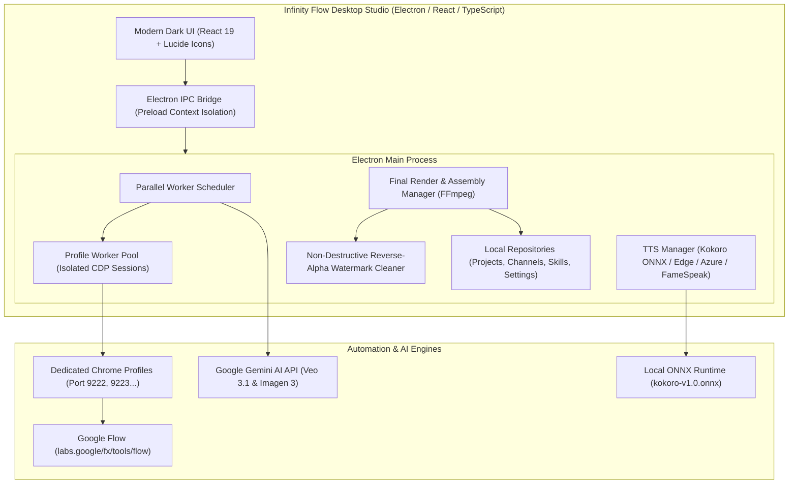

<div align="center">

# ♾️ Infinity Flow

### Next-Generation AI Video Generation & Automation Studio

[](./desktop/package.json)
[-0078D6.svg?style=flat-square&logo=windows)](https://microsoft.com/windows)
[](https://www.electronjs.org/)
[](https://react.dev/)
[](https://www.typescriptlang.org/)
[](https://vitejs.dev/)
[](https://onnxruntime.ai/)
[](./desktop/vitest.config.ts)
[](./LICENSE)

**Infinity Flow** is an enterprise-grade desktop automation studio and agentic video production pipeline. It seamlessly bridges browser-based generative AI environments ([Google Flow](https://labs.google/fx/tools/flow)) and direct API providers ([Google Gemini](https://ai.google.dev/)) with local neural text-to-speech, mathematical watermark mitigation, and fully automated multi-channel delivery.

[Key Features](#-key-features) •
[Architecture](#-architecture) •
[System Requirements](#-system-requirements) •
[Quick Start](#-quick-start) •
[Video Factory Pipeline](#-video-factory-pipeline) •
[Offline Neural TTS](#-offline-neural-tts-kokoro-onnx) •
[Verification & Testing](#-verification--testing) •
[Project Structure](#-project-structure)

</div>

---

## 🌟 Key Features

### 🎬 1. End-to-End Video Factory (5-Step Creation Pipeline)
- **Step 1: Script & Story Structure** — Multi-format script parsing (Markdown, numbered scene blocks, two-file narrator/prompt configurations) with natural sort media pairing (`1.jpg`, `2.jpg`, `10.jpg`).
- **Step 2: Voiceover & TTS Synthesis** — Multi-provider voice generation supporting offline Kokoro ONNX, Microsoft Edge TTS, Azure Speech, FameSpeak, and Ai33 with intelligent fallback chains.
- **Step 3: Visual & Scene Orchestration** — Flexible image and video generation using Google Flow models (**Imagen 3/4**, **Nano Banana 1/2/Pro**, **Veo 3.1 Quality/Fast/Lite**, **Omni 1.1 Flash**) and Gemini API providers.
- **Step 4: Subtitles, Transitions & Motion** — Automatic SRT/VTT subtitle synchronization, Ken Burns motion pans/zooms, cross-fades, and motion filter synthesis.
- **Step 5: Final Render & Channel Delivery** — FFmpeg-based multi-track audio ducking, resolution-matched scaling, non-destructive watermark mitigation, and direct delivery into organized channel repositories.

### 🛡️ 2. Multi-Account Dedicated Profile Isolation
- **Isolated Chrome Profiles** — Each Google Flow account operates in its own dedicated Chrome user data directory with an allocated Chrome DevTools Protocol (CDP) port.
- **Zero Cookie & Session Collisions** — True process-level isolation ensures credentials, browser caches, and rate-limit quotas never interfere across concurrent accounts.
- **Live Account Verification & Auto-Reconnect** — Transparent Google OAuth detection, automatic session verification, and persistent background connection management without storing user passwords.

### 🎙️ 3. Built-In Offline Neural TTS (Kokoro ONNX)
- **100% Offline Speech Generation** — Bundled with `kokoro-v1.0.onnx` and high-performance native ONNX Runtime Node bindings (`onnxruntime-node`).
- **Zero External API Costs** — Generate studio-grade speech directly on the host CPU without third-party subscriptions, internet access, or API rate limits.
- **Instant Voice Previews** — Real-time waveform audio preview directly inside the desktop interface.

### 🖼️ 4. Generation Studios (Single & Bulk)
- **Image Generation Studio** — Interactive single-prompt and bulk batch generation across all aspect ratios (`16:9`, `9:16`, `1:1`, `4:3`, `3:4`).
- **Gemini Video Studio** — Native support for Google Gemini Veo 3.1 (Cinema Quality 8s, Fast 4s/6s/8s) and Omni 1.1 Flash with prompt-driven generation.
- **Mathematical Watermark Mitigation** — Calibrated reverse-alpha blending algorithm (`GeminiImagePostProcessingService` & `GeminiPostProcessingService`) that non-destructively reconstructs watermark regions down to individual RGB channels without crude blurry delogo filters.

### 📡 5. Multi-Channel Automated Delivery
- **Intelligent Aspect-Ratio Routing** — Probes final video dimensions and automatically delivers `9:16` vertical videos to **Shorts** and `16:9` horizontal videos to **Longs** output directories.
- **Shorts Poster Frame Generation** — Renders dynamic poster frames from the first 2.0s while preserving continuous audio streams from 0.0s.
- **Audit Trails & Delivery History** — Complete delivery logs stored in SQLite/JSON repositories with instant reveal in Windows Explorer.

### 🔑 6. Multi-Key Gemini API Key Management
- **Round-Robin Key Rotation** — Distribute requests across multiple Gemini API keys.
- **Automatic Quota Failover** — Gracefully handles rate-limiting (`429`) errors by automatically failing over to standby active keys.
- **Encrypted Local Storage** — Stored securely in user application data directories (`%LOCALAPPDATA%`), never exposed to source control.

### 🤖 7. Model Context Protocol (MCP) Server
- Legacy and agentic MCP server integration (`src/index.js`) exposing 15+ automated tools to Claude Desktop, OpenCode, and external AI agents over stdio.

---

## 🏗️ Architecture



---

## 💻 System Requirements

| Requirement | Specification |
| :--- | :--- |
| **Operating System** | Windows 10 / Windows 11 (64-bit) |
| **Node.js** | Node.js **>= 20.0.0** |
| **Google Chrome** | Latest Google Chrome installed at default system path |
| **FFmpeg / FFprobe** | FFmpeg installed on system `PATH` (or specified in settings) |
| **Hardware** | Multi-core x64 CPU, 8 GB RAM minimum (16 GB recommended for batch rendering) |

---

## 🚀 Quick Start

### 1. Clone the Repository
```bash
git clone https://github.com/aiautomation786786/Automist-Labs-Flow.git
cd Automist-Labs-Flow
```

### 2. Install Dependencies
Install dependencies for both the root MCP server and the desktop studio:
```bash
# Install root dependencies
npm install

# Install desktop studio dependencies
cd desktop
npm install
cd ..
```

### 3. Launch Development Mode
```bash
cd desktop
npm run start
```
This compiles the TypeScript main process, builds the Vite React renderer, and launches the Electron application with Hot Module Replacement (HMR).

---

## 📦 Building & Packaging (Windows)

The desktop application is configured for production packaging using `electron-builder`:

### Create Unpacked Windows Application (`win-unpacked`)
```bash
cd desktop
npm run pack
```
Outputs the production-ready application to:
```
desktop/release/win-unpacked/InfinityFlow.exe
```

### Create Standalone Windows Installer
```bash
cd desktop
npm run package
```
Generates an optimized NSIS installer in `desktop/release/`.

### Create Portable Executable
```bash
cd desktop
npm run package:portable
```

---

## 🎙️ Offline Neural TTS (Kokoro ONNX)

Infinity Flow includes native offline text-to-speech powered by Kokoro and ONNX Runtime:

- **Model Location**: `desktop/assets/models/kokoro/kokoro-v1.0.onnx`
- **Engine**: Native commonjs bindings via `onnxruntime-node`
- **Fallback Hierarchy**:
  1. **Kokoro ONNX (Local Offline)** — Highest privacy, zero latency, zero cost.
  2. **Microsoft Edge TTS** — High-quality online neural voices.
  3. **Azure Speech Services** — Cloud-grade enterprise neural synthesis.
  4. **FameSpeak & Ai33** — Specialized character and custom voice engines.

```typescript
// Example TTS fallback invocation
const audioBuffer = await ttsManager.generateSpeech({
  text: "Welcome to Infinity Flow.",
  voice: "af_heart",
  provider: "kokoro"
});
```

---

## 🧪 Verification & Testing

Infinity Flow maintains a rigorous, automated testing suite using **Vitest**:

```bash
cd desktop

# Run the complete test suite (107 files, 808 tests)
npm run test

# Typecheck the complete TypeScript codebase
npm run typecheck

# Run tests in watch mode during development
npm run test:watch

# Generate comprehensive test coverage reports
npm run test:coverage
```

### Test Suite Coverage Highlights
- **107 Test Suites / 808 Unit & Integration Tests**:
  - `DedicatedProfileArchitecture.test.ts` — CDP port allocation, worker isolation, profile lifecycle.
  - `VideoFactoryPipeline.test.ts` — 5-stage pipeline integrity, crash recovery, and pause/resume logic.
  - `KokoroProvider.test.ts` & `TtsFallbackChain.test.ts` — ONNX tensor generation, fallback reliability.
  - `GeminiImagePostProcessing.test.ts` — Reverse-alpha watermark removal mathematical precision.
  - `ChannelExportShortsParity.test.ts` — Shorts/Longs routing, thumbnail overlays, and delivery audits.
  - `ProfilesScreen.test.tsx` & `SettingsScreen.test.tsx` — Full React component mounting and interaction parity.

---

## 📂 Project Structure

```
google-flow-browser-mcp/
├── desktop/                          # Infinity Flow Desktop Application (Electron)
│   ├── assets/                       # Bundled production assets & models
│   │   ├── icon.ico / icon.png       # Application identity icons
│   │   ├── infinity-flow-logo.svg    # Vector brand assets
│   │   └── models/kokoro/            # Offline Kokoro ONNX neural model
│   │       └── kokoro-v1.0.onnx
│   ├── scripts/                      # Build, packaging & verification scripts
│   ├── src/
│   │   ├── main/                     # Electron Main Process
│   │   │   ├── automation/           # Chrome CDP & Google Flow driver
│   │   │   ├── execution/            # Gemini Image & Video execution services
│   │   │   ├── render/               # FFmpeg assembly, motion filters & mixers
│   │   │   ├── scheduler/            # Multi-worker concurrency pool
│   │   │   ├── storage/              # Local SQLite/JSON repositories
│   │   │   ├── tts/                  # Kokoro, Edge, Azure, Ai33, FameSpeak
│   │   │   └── utils/                # Loggers, FFmpeg resolvers, Zip utilities
│   │   ├── renderer/                 # Electron Renderer (React 19 + Vite)
│   │   │   ├── components/           # AppShell, Modals, SegmentedControls
│   │   │   ├── screens/              # Studio, Factory, Profiles, Settings, Channels
│   │   │   └── styles/               # Production dark-mode styles
│   │   ├── shared/                   # Cross-process contracts, types & schemas
│   │   └── tests/                    # 107 Vitest unit & integration test suites
│   ├── electron-builder.json         # Windows packaging configuration
│   ├── package.json                  # Desktop dependencies & scripts
│   ├── tsconfig.json                 # TypeScript compiler configuration
│   └── vite.config.ts                # Vite renderer bundle configuration
│
├── src/                              # Model Context Protocol (MCP) Server
│   ├── browser/                      # CDP browser connection & anti-detection
│   ├── navigation/                   # Google Flow project navigation
│   ├── queue/                        # Single-job concurrency queue
│   ├── tools/                        # 15+ MCP agentic tool definitions
│   └── utils/                        # Logging, file management & error handling
│
├── scripts/                          # Root automation & testing utilities
├── .gitignore                        # Strict exclusions for build artifacts & credentials
├── ARCHITECTURE_SPEC.md              # Technical architecture specification
├── ZBOT_SPEC.md                      # Pipeline & parity specifications
└── README.md                         # Project documentation
```

---

## 🛡️ Security, Privacy & Safety Principles

1. **Zero Credential Exfiltration** — Infinity Flow interacts with Google Flow using direct Chrome DevTools Protocol connections to local browser sessions. Passwords, cookies, and tokens are never stored, exported, or transmitted to any external server.
2. **Local Data Persistence** — Projects, channel delivery configs, and skills are stored locally on the user's filesystem in `%LOCALAPPDATA%`.
3. **No Brute-Force Botting** — Automation actions include natural human delays (`actionDelayMs`), transparent window options, and clean graceful pauses when security checkpoints or captchas occur.
4. **Non-Destructive Media Pipelines** — All AI post-processing creates safe original backups (`*_original.png` / `*_original.mp4`) before executing localized watermark mitigation.

---

## 📄 License

This project is licensed under the **MIT License**. See [LICENSE](./LICENSE) for details.

---

<div align="center">
  <sub>Built by <b>Automist Labs</b></sub>
</div>

