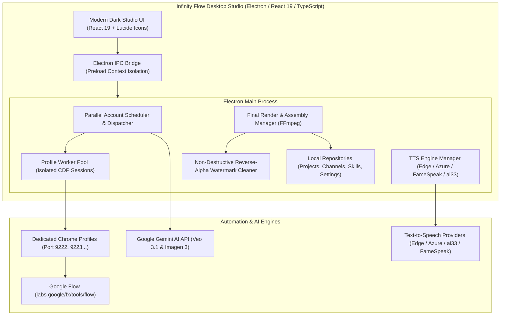

<div align="center">

# ♾️ Infinity Flow

### Next-Generation AI Video Generation & Desktop Automation Studio

[](./desktop/package.json)
[%20%7C%20Windows%2010%2F11-0078D6.svg?style=flat-square)](https://github.com/aiautomation786786/Automist-Labs-Flow)
[](https://www.electronjs.org/)
[](https://react.dev/)
[](https://www.typescriptlang.org/)
[](https://vitejs.dev/)
[](./desktop/vitest.config.ts)
[](./LICENSE)

**Infinity Flow** is an enterprise-grade desktop automation studio and agentic media production pipeline. It seamlessly bridges browser-based generative AI environments ([Google Flow](https://labs.google/fx/tools/flow)) and direct API providers ([Google Gemini](https://ai.google.dev/)) with multi-account Chrome DevTools Protocol (CDP) orchestration, multi-engine text-to-speech synthesis, automated mathematical reverse-alpha watermark mitigation, and automated multi-channel video delivery.

[Key Features](#-key-features) •
[Architecture](#-architecture) •
[System Requirements](#-system-requirements) •
[Quick Start](#-quick-start) •
[Packaging & Distribution](#-packaging--distribution) •
[Single Video & Image Studios](#-studio-generation-capabilities) •
[Video Factory Pipeline](#-video-factory-pipeline) •
[Verification & Testing](#-verification--testing) •
[Security & Privacy](#-security-privacy--safety-principles)

</div>

---

## 🌟 Key Features

### 🎬 1. Dedicated Single Video Studio
A focused, distraction-free generation studio tailored for high-fidelity AI video creation:
- **Veo 3.1 Quality** *(Google Flow)*: Cinema-grade video generation with locked native **10s** duration indicator.
- **Veo 3.1 Fast** *(Google Flow)*: High-speed video synthesis with locked native **8s** duration indicator.
- **Veo 3.1 Lite** *(Google Flow)*: Lightweight and rapid video generation with locked native **8s** duration indicator.
- **Omni 1.1 Flash via Flow**: Interactive prompt generation with flexible duration controls (**4s**, **6s**, **8s**, **10s**) and selectable resolutions (**360p** & **720p**).
- **Omni 1.1 Flash via Gemini (Clean)**: Direct API generation (**10s**, **720p HD**) enhanced by automated post-processing that eliminates watermarks using non-destructive reverse-alpha reconstruction.
- **Full Aspect Ratio Support**: Instant switching between **16:9 Landscape** and **9:16 Portrait / Shorts**.
- **Real-Time Generation Modal**: Live multi-stage progress tracking (initializing session, submitting prompt, rendering video, downloading output) with direct video playback and file reveal.

### 🖼️ 2. Dedicated Single Image Studio
- **Curated Model Selection**: Native support for Google Flow's flagship models (**Imagen 3**, **Nano Banana 2**, **Nano Banana Pro**, **Nano Banana Lite**) and Google Gemini API (**Imagen 3 Clean**).
- **Comprehensive Aspect Ratios**: One-click switching between **16:9**, **9:16**, **1:1 Square**, **4:3**, and **3:4**.
- **Locked Native Output**: True high-resolution output delivered directly from provider engines without synthetic upscaling.
- **Direct Asset Inspection**: Integrated lightbox image preview, full prompt inspection, and one-click file reveal in your system file manager.

### 🛡️ 3. Multi-Account Dedicated Profile Isolation
- **Isolated Chrome Profiles**: Each Google Flow account runs inside its own dedicated Chrome user data directory with an independent Chrome DevTools Protocol (CDP) port.
- **Zero Cookie & Session Collisions**: Full process-level isolation ensures credentials, browser caches, and rate-limit quotas never conflict across concurrent generation jobs.
- **Live Account Verification & Auto-Reconnect**: Transparent Google OAuth detection, automatic session health monitoring, and background connection restoration without storing user passwords.

### 🏭 4. End-to-End Video Factory (5-Step Creation Pipeline)
- **Step 1: Script & Story Structure**: Multi-format script parsing (Markdown, numbered scene blocks, narrator/prompt configurations) with natural sort media pairing (`1.jpg`, `2.jpg`, `10.jpg`).
- **Step 2: Voiceover & TTS Synthesis**: Multi-provider voice generation supporting Microsoft Edge TTS (Free Neural), Azure Speech, FameSpeak, and ai33.pro with intelligent fallback chains.
- **Step 3: Visual & Scene Orchestration**: Flexible scene-by-scene media generation dispatched across available isolated accounts.
- **Step 4: Subtitles, Transitions & Motion**: Automatic SRT/VTT subtitle synchronization, Ken Burns motion pans/zooms, cross-fades, and motion filter synthesis.
- **Step 5: Final Render & Channel Delivery**: FFmpeg-based multi-track audio ducking, resolution-matched scaling, watermark mitigation, and automated delivery into organized channel repositories.

### 📡 5. Multi-Channel Automated Delivery
- **Intelligent Aspect-Ratio Routing**: Automatically analyzes final video dimensions and delivers `9:16` vertical videos to **Shorts** and `16:9` horizontal videos to **Longs** output directories.
- **Shorts Poster Frame Generation**: Renders dynamic poster frames from the first 2.0s while preserving continuous audio streams from 0.0s.
- **Audit Trails & Delivery History**: Complete delivery logs stored locally in SQLite/JSON repositories with instant reveal in Finder / Windows Explorer.

### 🔑 6. Multi-Key Gemini API Key Management
- **Round-Robin Key Rotation**: Distribute generation requests across multiple API keys.
- **Automatic Quota Failover**: Gracefully handles rate-limiting (`429`) errors by automatically failing over to standby active keys.
- **Encrypted Local Storage**: Stored securely in user application data directories, never exposed to source control.

### 🤖 7. Model Context Protocol (MCP) Server
- Integrated agentic MCP server (`src/index.js`) exposing 15+ automated tools to Claude Desktop, OpenCode, and external AI agents over stdio.

---

## 🏗️ Architecture


```mermaid
flowchart TB
    subgraph DesktopApp["Infinity Flow Desktop Studio (Electron / React 19 / TypeScript)"]
        UI["Modern Dark Studio UI (React 19 + Lucide Icons)"]
        IPC["Electron IPC Bridge (Preload Context Isolation)"]
        
        subgraph MainProcess["Electron Main Process"]
            Scheduler["Parallel Account Scheduler & Dispatcher"]
            WorkerPool["Profile Worker Pool (Isolated CDP Sessions)"]
            TtsManager["TTS Engine Manager (Edge / Azure / FameSpeak / ai33)"]
            RenderManager["Final Render & Assembly Manager (FFmpeg)"]
            PostProcessing["Non-Destructive Reverse-Alpha Watermark Cleaner"]
            Storage["Local Repositories (Projects, Channels, Skills, Settings)"]
        end
    end

    subgraph ExternalEngines["Automation & AI Engines"]
        ChromeProfiles["Dedicated Chrome Profiles (Port 9222, 9223...)"]
        GoogleFlow["Google Flow (labs.google/fx/tools/flow)"]
        GeminiAPI["Google Gemini AI API (Veo 3.1 & Imagen 3)"]
        TtsEngines["Text-to-Speech Providers (Edge / Azure / ai33 / FameSpeak)"]
    end

    UI --> IPC
    IPC --> MainProcess
    Scheduler --> WorkerPool
    WorkerPool --> ChromeProfiles --> GoogleFlow
    Scheduler --> GeminiAPI
    TtsManager --> TtsEngines
    RenderManager --> PostProcessing
    RenderManager --> Storage
```

---

## 🎥 Studio Generation Capabilities

### Single Video Studio Matrix

| Model | Provider | Native Duration | Resolution | Watermark Status |
| :--- | :--- | :--- | :--- | :--- |
| **Veo 3.1 Quality** | Google Flow | Fixed 10s (Cinema) | Provider Native | Standard |
| **Veo 3.1 Fast** | Google Flow | Fixed 8s (High Speed) | Provider Native | Standard |
| **Veo 3.1 Lite** | Google Flow | Fixed 8s (Lightweight) | Provider Native | Standard |
| **Omni 1.1 Flash (Flow)** | Google Flow | 4s / 6s / 8s / 10s | 360p / 720p | Standard |
| **Omni 1.1 Flash (Gemini)** | Gemini API | Fixed 10s | 720p HD | **Watermark Removed Automatically** (Reverse-Alpha) |

### Single Image Studio Matrix

| Model | Provider | Aspect Ratios | Output |
| :--- | :--- | :--- | :--- |
| **Imagen 3** | Google Flow | 16:9, 9:16, 1:1, 4:3, 3:4 | Native Full Resolution |
| **Nano Banana 2** | Google Flow | 16:9, 9:16, 1:1, 4:3, 3:4 | Native Full Resolution |
| **Nano Banana Pro** | Google Flow | 16:9, 9:16, 1:1, 4:3, 3:4 | Native Full Resolution |
| **Nano Banana Lite** | Google Flow | 16:9, 9:16, 1:1, 4:3, 3:4 | Native Full Resolution |
| **Gemini Imagen 3** | Gemini API | 16:9, 9:16, 1:1, 4:3, 3:4 | Clean Reconstructed Output |

---

## 💻 System Requirements

| Requirement | Specification |
| :--- | :--- |
| **Operating System** | macOS 13+ (Apple Silicon `arm64` or Intel `x64`) / Windows 10 & 11 (64-bit) |
| **Node.js** | Node.js **>= 20.0.0** (Node 22 or 24 recommended) |
| **Google Chrome** | Latest Google Chrome installed at default system path |
| **FFmpeg / FFprobe** | FFmpeg installed on system `PATH` (or configured via application settings) |
| **Hardware** | Multi-core CPU, 8 GB RAM minimum (16 GB recommended for batch video rendering) |

---

## 🚀 Quick Start

### 1. Clone the Repository
```bash
git clone https://github.com/aiautomation786786/Automist-Labs-Flow.git
cd Automist-Labs-Flow
```

### 2. Install Dependencies
```bash
# Install root MCP dependencies
npm install

# Install desktop studio dependencies
cd desktop
npm install
cd ..
```

### 3. Launch Development Mode
```bash
cd desktop
npm run dev
# or
npm run start
```
This compiles the TypeScript main process, boots the Vite React renderer with Hot Module Replacement (HMR), and launches the Electron application.

---

## 📦 Packaging & Distribution

The desktop application is configured for production builds using `electron-builder`:

### macOS (Apple Silicon `arm64` & Intel `x64`)
```bash
cd desktop

# Build unpacked macOS application directory:
CSC_IDENTITY_AUTO_DISCOVERY=false npm run package:mac:dir
```
Outputs the production application bundle to:
```
desktop/release/mac-arm64/Infinity Flow.app
```

### Windows (x64)
```bash
cd desktop

# Create unpacked application directory:
npm run pack

# Create production NSIS installer (.exe):
npm run package

# Create standalone portable executable:
npm run package:portable
```
Outputs installer and unpacked binaries to `desktop/release/`.

---

## 🎙️ Voiceover & Text-to-Speech Engine

Infinity Flow features a multi-provider speech synthesis engine with built-in fail-safe fallback:

- **Free Primary Engine**: Native Microsoft Edge TTS provides studio-grade neural speech and millisecond-accurate word boundary timings for automated subtitle alignment without API keys or costs.
- **Cloud & Celebrity Engines**: Azure Speech Services (HD Neural), ai33.pro (multi-source voice models), and FameSpeak (celebrity voices).
- **Graceful Fallback Hierarchy**:
  1. **Selected Provider** — User's chosen voice engine.
  2. **Immediate Retry** — Automatic retry if transient network fluctuations occur.
  3. **Guaranteed Edge TTS Fallback** — Instant fallback to free Edge TTS ensuring video generation never aborts due to voice API limits.

```typescript
// Example TTS narration synthesis with automatic fallback
const narrationResult = await ttsManager.synthesizeSceneWithFallback(
  "Miles beneath the surface, bioluminescent organisms illuminate the deep.",
  "azure",
  "en-US-JennyNeural"
);
```

---

## 🧪 Verification & Testing

Infinity Flow maintains an extensive automated testing suite using **Vitest**:

```bash
cd desktop

# Run the complete test suite (116 files, 951 tests)
npm test

# Typecheck the complete TypeScript codebase
npm run typecheck

# Run tests in watch mode during development
npm run test:watch

# Generate test coverage reports
npm run test:coverage
```

### Test Suite Highlights
- **116 Test Suites / 950+ Unit & Integration Tests**:
  - `SingleVideoStudio.test.tsx` — Single Video Studio UI, fixed 10s/8s duration constraints, and Gemini Clean mode.
  - `SingleImageStudio.test.tsx` — Single Image Studio UI, aspect ratio switching, and model card selection.
  - `GeminiPostProcessing.test.ts` — Non-destructive reverse-alpha watermark mitigation mathematical precision.
  - `DedicatedProfileArchitecture.test.ts` — CDP port allocation, worker isolation, and profile lifecycle.
  - `VideoFactoryPipeline.test.ts` — 5-stage pipeline integrity, crash recovery, and pause/resume logic.
  - `TtsFallbackChain.test.ts` — Multi-provider fallback chain, retry guarantees, and graceful downgrade.
  - `ChannelExportShortsParity.test.ts` — Shorts/Longs routing, thumbnail overlays, and delivery audits.

---

## 📂 Project Structure

```
google-flow-browser-mcp/
├── desktop/                          # Infinity Flow Desktop Application (Electron)
│   ├── assets/                       # Bundled production assets & brand icons
│   │   ├── icon.ico / icon.png       # Application identity icons
│   │   └── infinity-flow-logo.svg    # Vector brand assets
│   ├── scripts/                      # Build, packaging & verification scripts
│   ├── src/
│   │   ├── main/                     # Electron Main Process
│   │   │   ├── automation/           # Chrome CDP & Google Flow driver
│   │   │   ├── execution/            # Gemini Image & Video execution services
│   │   │   ├── render/               # FFmpeg assembly, motion filters & mixers
│   │   │   ├── scheduler/            # Multi-worker concurrency pool
│   │   │   ├── storage/              # Local SQLite/JSON repositories
│   │   │   ├── tts/                  # Edge, Azure, Ai33, FameSpeak
│   │   │   └── utils/                # Loggers, FFmpeg resolvers, Zip utilities
│   │   ├── renderer/                 # Electron Renderer (React 19 + Vite)
│   │   │   ├── components/           # AppShell, Modals, SegmentedControls
│   │   │   ├── screens/              # SingleImageStudio, SingleVideoStudio, Factory, Profiles, Settings
│   │   │   └── styles/               # Production dark-mode styles
│   │   ├── shared/                   # Cross-process contracts, types & schemas
│   │   └── tests/                    # 116 Vitest unit & integration test suites
│   ├── electron-builder.json         # Packaging configuration (macOS & Windows)
│   ├── package.json                  # Desktop dependencies & scripts
│   ├── tsconfig.json                 # TypeScript compiler configuration
│   └── vite.config.ts                # Vite renderer bundle configuration
│
├── src/                              # Model Context Protocol (MCP) Server
│   ├── browser/                      # CDP browser connection & anti-detection
│   ├── navigation/                   # Google Flow project navigation
│   ├── queue/                        # Single-job concurrency queue
│   ├── tools/                        # 15+ MCP agentic tool definitions
│   └── utils/                        # Logging, file management & error handling
│
├── scripts/                          # Root automation & testing utilities
├── .gitignore                        # Strict exclusions for build artifacts & credentials
├── ARCHITECTURE_SPEC.md              # Technical architecture specification
├── ZBOT_SPEC.md                      # Pipeline & parity specifications
└── README.md                         # Project documentation
```

---

## 🛡️ Security, Privacy & Safety Principles

1. **Zero Credential Exfiltration** — Infinity Flow interacts with Google Flow using direct Chrome DevTools Protocol connections to local browser sessions. Passwords, cookies, and tokens are never stored, exported, or transmitted to any external server.
2. **Local Data Persistence** — Projects, channel delivery configs, and user settings are stored locally on the user's filesystem in `~/.google-flow-app` (macOS/Linux) or `%LOCALAPPDATA%/Infinity Flow` (Windows).
3. **No Brute-Force Automation** — Automation actions use humanized delays, transparent window options, and clean graceful pauses when security checkpoints or captchas occur.
4. **Non-Destructive Media Pipelines** — All AI post-processing creates safe original backups (`*_original.png` / `*_original.mp4`) before executing localized watermark mitigation.

---

## 📄 License

This project is licensed under the **MIT License**. See [LICENSE](./LICENSE) for details.

---

<div align="center">
  <sub>Built by <b>Automist Labs</b></sub>
</div>
